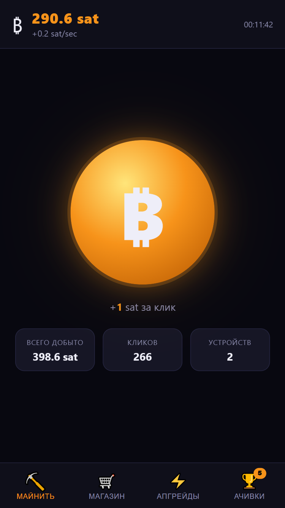

<div align="center">

# ₿ Bitcoin Miner Idle

**Mobile-first Bitcoin clicker & idle game — pure HTML/CSS/JS, zero dependencies**

[](https://AndreiYakovlev.github.io/bitcoin-miner-idle/)

</div>



## 🎮 Gameplay

Start with **0 BTC** and tap the coin to earn your first satoshi. Reinvest into miners that auto-generate income — from a dusty GTX 1060 all the way up to a Dyson Sphere. Reach prestige thresholds to restart with permanent multipliers, and spend crystals 💎 in the gem shop for special boosts.

```
1 BTC = 100,000,000 satoshi
```

### 🔁 Progression loop

```
Tap coin  →  Earn satoshi  →  Buy miners  →  Buy upgrades  →  Earn faster  →  Prestige  →  …
```

## 🎯 Content

- **⛏️ 22 miners** — from a GTX 1060 to a Dyson Sphere, each ×1.15 more expensive per purchase
- **⚡ 15 upgrades** — 7 multiply click power, 8 multiply all sat/sec
- **🏆 46 achievements** — balance, clicks, devices, sat/sec, playtime, prestige, managers
- **👔 5 managers** — auto-click the coin for you
- **💎 9 permanent gem upgrades** — offline time, click & mine multipliers, boosts
- **♻️ Prestige** — reset for a permanent multiplier, repeat for compounding bonuses
- **⚡ Frenzy** — random events that spike click income for a short time
- **📊 Stats tab** — full session breakdown

## 💾 Save system

Progress is auto-saved to **`localStorage`** every 15 seconds and on every purchase. No account or server needed — your save lives in the browser.

## 🗂️ Project structure

```
bitcoin-miner-idle/
├── index.html          # markup only
├── css/
│   ├── style.css       # root variables, resets, layout
│   ├── base.css        # base element styles
│   ├── header.css      # top header & balance bar
│   ├── mine.css        # mine tab — coin, click area
│   ├── shop.css        # shop & upgrade card styles
│   ├── panels.css      # tab panels & nav bar
│   ├── modals.css      # gem shop & prestige modals
│   ├── gems.css        # gem/crystal UI
│   └── drops.css       # drop/frenzy animations
└── js/
    ├── data.js         # MINERS, UPGRADES, ACHIEVEMENTS constants
    ├── utils.js        # fmt(), fmtBalance(), fmtSps(), fmtTime()
    ├── state.js        # game state G{}, save/load, calcSps, recalcMults
    ├── render.js       # all DOM rendering functions
    ├── actions.js      # buyMiner(), buyUpgrade(), doClick()
    ├── achievements.js # checkAchievements(), popup queue
    └── main.js         # game loop, tabs, autosave, init
```

---

<div align="center">

Made with ☕ and vanilla JS · No frameworks · No build tools · No nonsense

</div>
