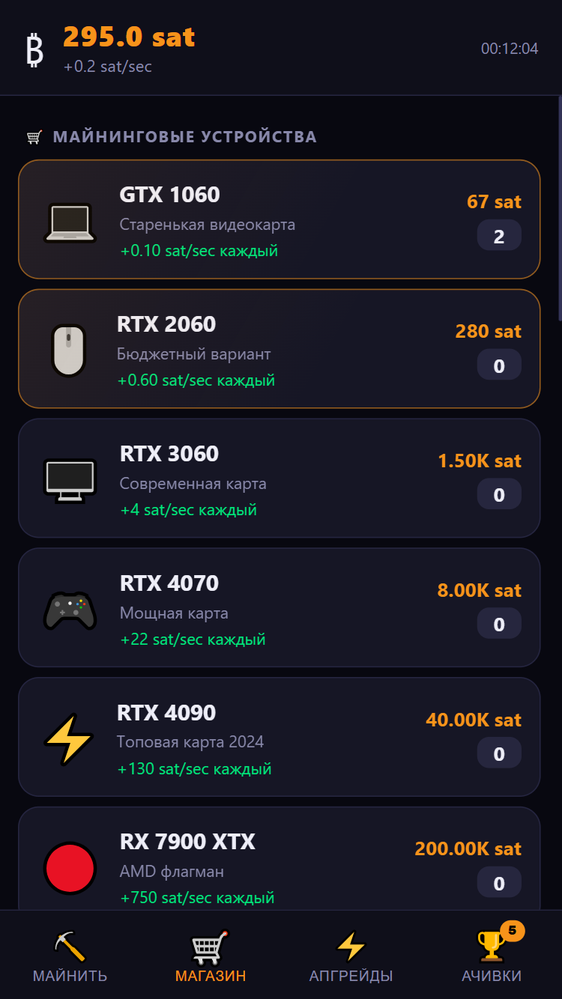
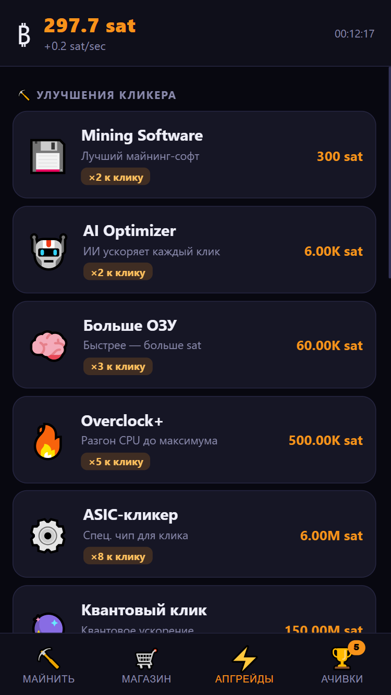
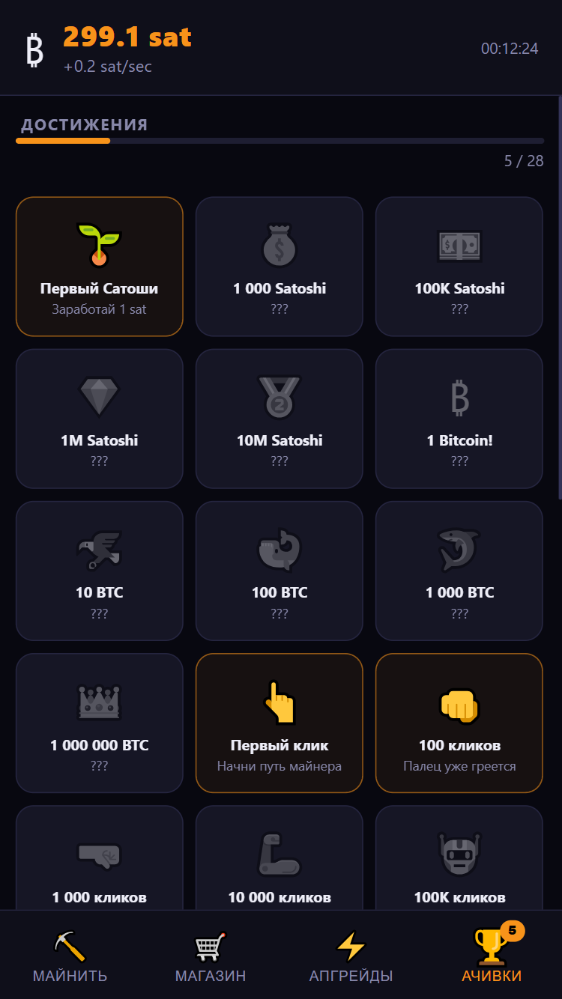

<div align="center">

# ₿ Bitcoin Miner Idle

**Mobile-first Bitcoin clicker & idle game — pure HTML/CSS/JS, zero dependencies**

[](https://AndreiYakovlev.github.io/bitcoin-miner-idle/)
[](https://developer.mozilla.org/en-US/docs/Web/HTML)
[](https://developer.mozilla.org/en-US/docs/Web/CSS)
[](https://developer.mozilla.org/en-US/docs/Web/JavaScript)

</div>

---

## 📸 Screenshots

<div align="center">

| ⛏️ Mine | 🛒 Shop |
|:---:|:---:|
|  |  |

| ⚡ Upgrades | 🏆 Achievements |
|:---:|:---:|
|  |  |

</div>

---

## 🎮 Gameplay

Start with **0 BTC** and tap the coin to earn your first satoshi. Reinvest into miners that auto-generate income — from a dusty GTX 1060 all the way up to a Dyson Sphere.

```
1 BTC = 100,000,000 satoshi
```

### 🔁 Progression loop

```
Tap coin  →  Earn satoshi  →  Buy miners  →  Buy upgrades  →  Earn faster  →  …
```

---

## ⛏️ Miners (22 total)

| # | Device | Base price | sat/sec |
|---|--------|-----------|---------|
| 1 | 💻 GTX 1060 | 50 sat | 0.1 |
| 2 | 🖱️ RTX 2060 | 280 sat | 0.6 |
| 3 | 🖥️ RTX 3060 | 1 500 sat | 4 |
| 4 | 🎮 RTX 4070 | 8 000 sat | 22 |
| 5 | ⚡ RTX 4090 | 40 000 sat | 130 |
| 6 | 🔴 RX 7900 XTX | 200 000 sat | 750 |
| 7 | 🔧 Rig 4× GPU | 1 000 000 sat | 4 500 |
| 8 | 🔩 Rig 8× GPU | 6 000 000 sat | 30 000 |
| 9 | 🏗️ Mega Rig 16× | 35 000 000 sat | 200 000 |
| 10 | 📦 Antminer S9 | 200 000 000 sat | 1 300 000 |
| 11 | 📫 Antminer S17 | 1.2B sat | 9 000 000 |
| 12 | 🚗 Antminer S19 Pro | 7B sat | 60 000 000 |
| 13 | 🚀 Antminer S21 XP | 40B sat | 420 000 000 |
| 14 | 💎 Whatsminer M66S | 250B sat | 3B |
| 15 | 🏚️ Мини-ферма | 1.5T sat | 22B |
| 16 | 🚢 Контейнер | 10T sat | 160B |
| 17 | 🏢 Дата-центр | 70T sat | 1.2T |
| 18 | 💧 Гидро-ферма | 500T sat | 9T |
| 19 | ☀️ Солнечная ферма | 4Qa sat | 75T |
| 20 | ☢️ АЭС-Ферма | 30Qa sat | 600T |
| 21 | 🔮 Квантовый майнер | 250Qa sat | 5Qa |
| 22 | 🌟 Сфера Дайсона | 2Qi sat | 45Qa |

> Each repeat purchase multiplies the price by **×1.15** and adds another unit to your fleet.

---

## ⚡ Upgrades (14 total)

### Click upgrades — multiply sat per tap

| Upgrade | Cost | Multiplier |
|---------|------|-----------|
| 💾 Mining Software | 300 sat | ×2 |
| 🤖 AI Optimizer | 6 000 sat | ×2 |
| 🧠 Больше ОЗУ | 60 000 sat | ×3 |
| 🔥 Overclock+ | 500 000 sat | ×5 |
| ⚙️ ASIC-кликер | 6 000 000 sat | ×8 |
| 🔮 Квантовый клик | 150 000 000 sat | ×15 |
| 💥 Ultra Click | 5B sat | ×25 |

### Mine upgrades — multiply all sat/sec

| Upgrade | Cost | Multiplier |
|---------|------|-----------|
| ❄️ Лучшее охлаждение | 2 000 sat | ×1.5 |
| ⚡ Дешёвый ток | 40 000 sat | ×2 |
| 🌐 Mining Pool | 600 000 sat | ×2 |
| 🌱 Зелёная энергия | 8 000 000 sat | ×2 |
| 🧬 ИИ-управление | 150 000 000 sat | ×3 |
| 💦 Жидкостное охл. | 4B sat | ×3 |
| 🔆 Ядерный синтез | 200B sat | ×5 |
| 🌌 Тёмная энергия | 10T sat | ×8 |

---

## 🏆 Achievements (28 total)

Achievements are grouped into five categories:

| Category | Examples |
|----------|---------|
| 💰 Balance milestones | First Satoshi → 1M sat → 1 BTC → 1M BTC |
| 👆 Click count | 1 click → 100 → 1K → 10K → 100K |
| 🖥️ Devices owned | 1 device → 10 → 50 → 100 → 250 |
| 🚀 sat/sec rate | 100/s → 10K/s → 1M/s → 1B/s → 1T/s |
| ⏱️ Playtime | HODL (10 min) · To the Moon (1 hour) |
| ⭐ Special | Buy all upgrades |

---

## 💾 Save system

Progress is auto-saved to **`localStorage`** every 15 seconds and on every purchase. No account or server needed — your save lives in the browser.

---

## 🗂️ Project structure

```
bitcoin-miner-idle/
├── index.html          # markup only
├── css/
│   └── style.css       # all styles (dark theme, animations)
└── js/
    ├── data.js         # MINERS, UPGRADES, ACHIEVEMENTS constants
    ├── utils.js        # fmt(), fmtBalance(), fmtSps(), fmtTime()
    ├── state.js        # game state G{}, save/load, calcSps, recalcMults
    ├── render.js       # all DOM rendering functions
    ├── actions.js      # buyMiner(), buyUpgrade(), doClick()
    ├── achievements.js # checkAchievements(), popup queue
    └── main.js         # game loop, tabs, autosave, init
```

---

<div align="center">

Made with ☕ and vanilla JS · No frameworks · No build tools · No nonsense

</div>
